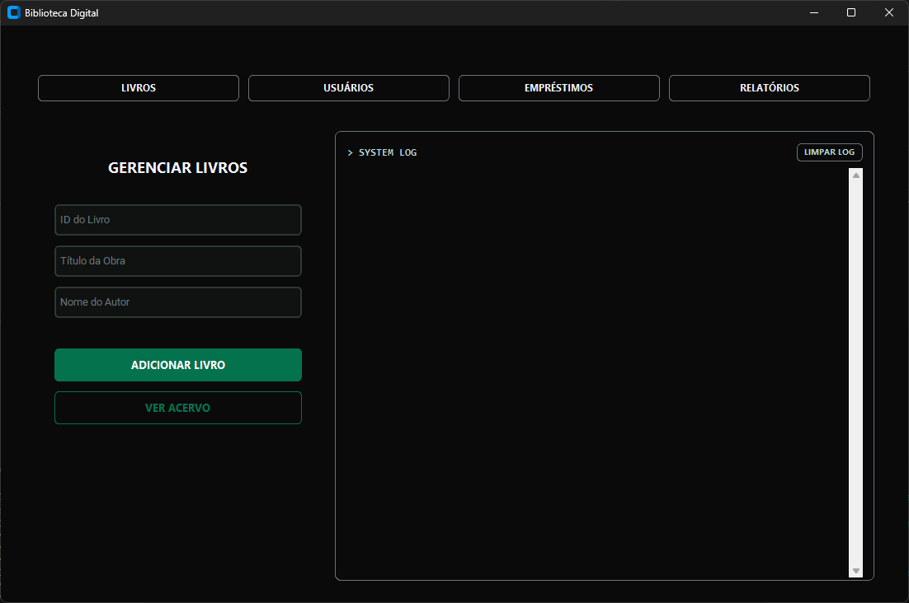
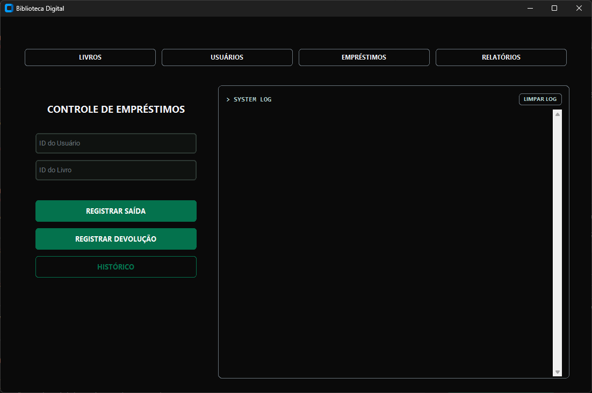
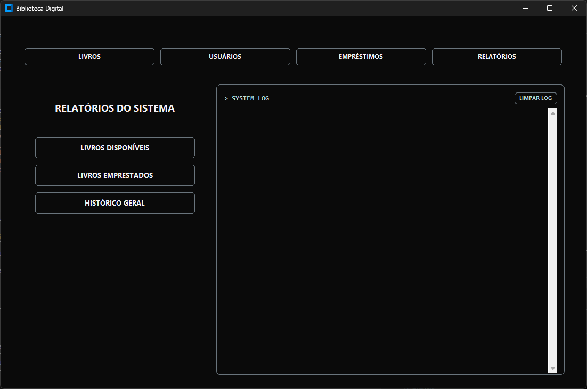

### 📂 `readmes/00-biblioteca.md`

## 🔶 Interface: "Livros"

1. App Limpo (tela inicial da seção Livros)

2. Cadastrando um Livro e Capturando o Log

3. Visualizando o Acervo (Ver Livros)

## 🔶 Interface: "Usuários"

1. App Limpo (tela inicial da seção Livros)

2. Cadastrando um Usuário e Capturando o Log

3. Visualizando a Lista de Usuários

## 🔶 Interface: "Empréstimos"

1. App Limpo (tela inicial da seção Empréstimos/Devoluções)

2. Registrando um Empréstimo e Capturando o Log

3. Registrando uma Devolução e Capturando o Log

4. Visualizando o Histórico de Movimentações

## 🔶 Interface: "Relatórios"

1. App Limpo (tela inicial da seção Relatórios)

2. Relatório de Livros Disponíveis

3. Relatório de Livros Emprestados

4. Histórico Geral

