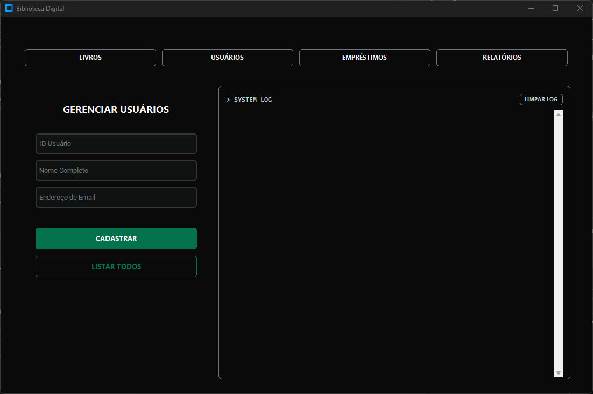
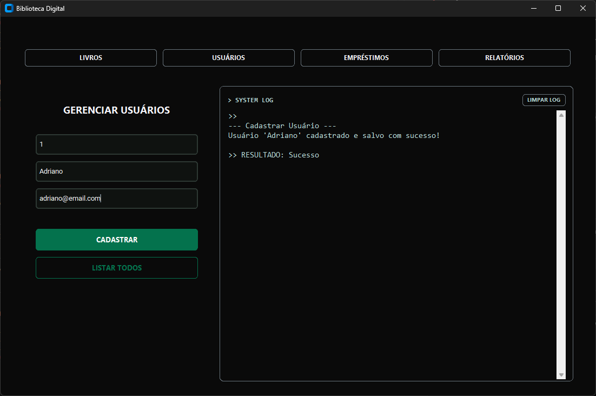

### 📂 `readmes/02-usuarios.md`

Este passo implementa o módulo de **gerenciamento de usuários**, responsável por cadastrar, buscar, listar e remover usuários da Biblioteca Digital, persistindo todos os dados em JSON.

## 🔶 Objetivo

- Cadastrar usuários com ID único, nome e e-mail.
- Remover usuários pelo ID.
- Buscar usuários pelo ID, exibindo informações completas.
- Listar todos os usuários cadastrados. 
- Persistir todas as alterações em JSON, garantindo que os dados não sejam perdidos ao fechar o programa.

## 🔶 Estrutura utilizada
- Arquivo JSON para armazenamento persistente: ``usuarios.json``
- Módulo Python: ``src/usuarios.py``
- Funções principais:
    - ``cadastrar_usuario(id, nome, email)``
    - ``remover_usuario(id)``
    - ``buscar_usuario(id)``
    - ``listar_usuarios()``

## 🔶 Interface
Para ilustrar o fluxo dentro do app, podemos dividir em três momentos principais:

1. App Limpo (tela inicial da seção Livros)

2. Cadastrando um Usuário e Capturando o Log

3. Visualizando a Lista de Usuários

## 🔶 Resultado

- Usuário cadastrado corretamente no JSON.
- Listagem mostra quantidade de usuários e dados completos.
- Remoção de usuário atualiza imediatamente o arquivo JSON.
- Integração direta com o app, mostrando o fluxo completo dentro da interface.

