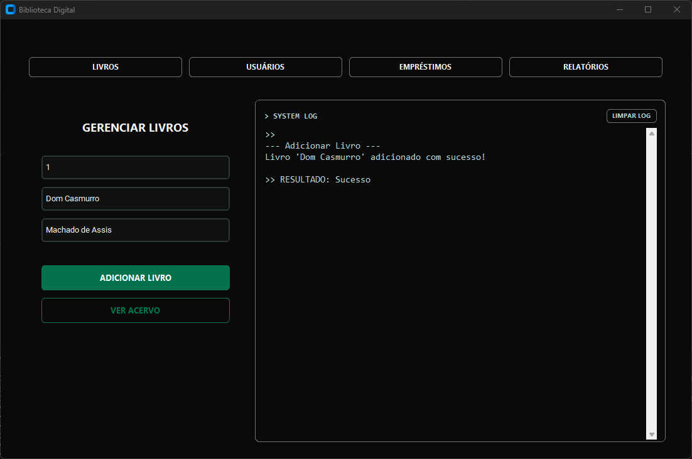
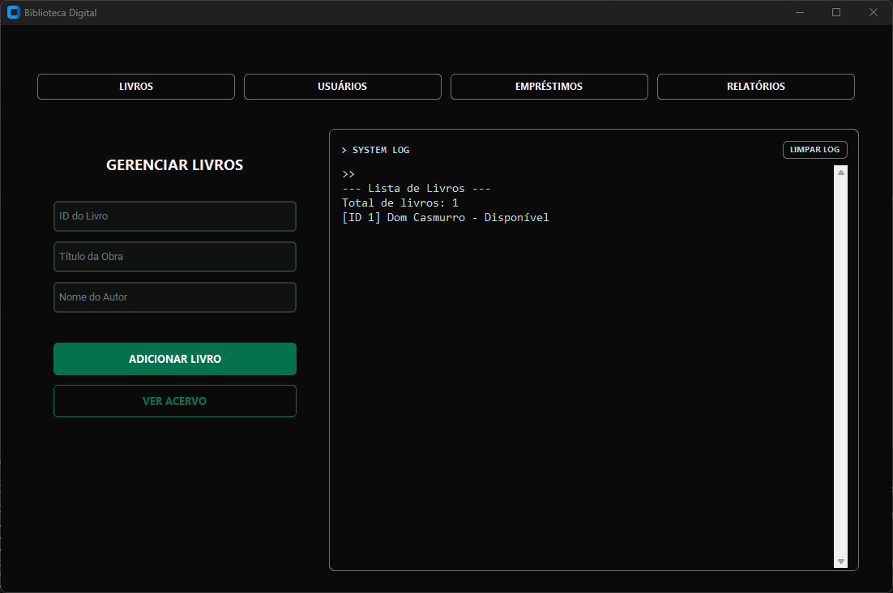
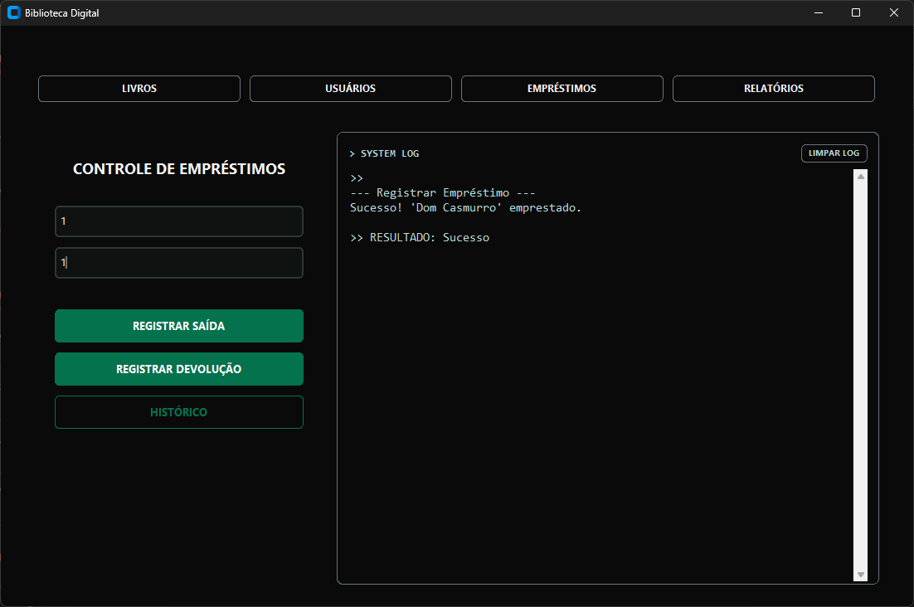
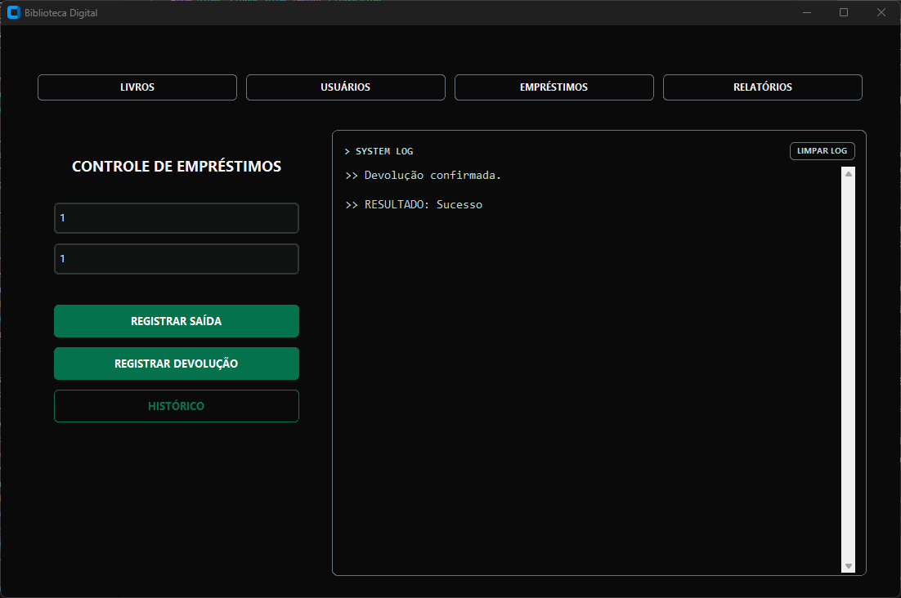
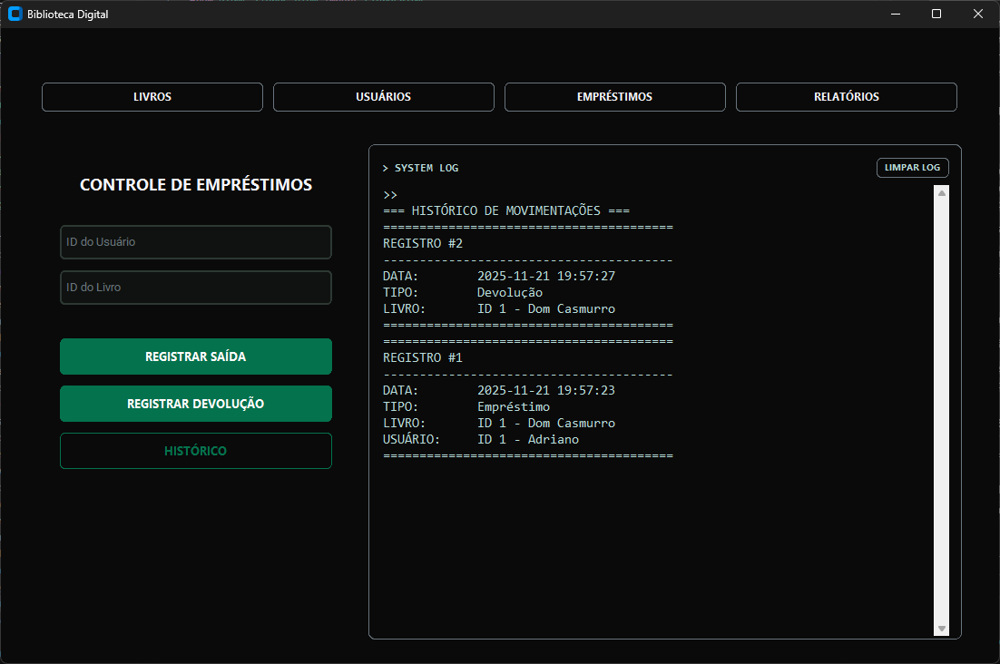
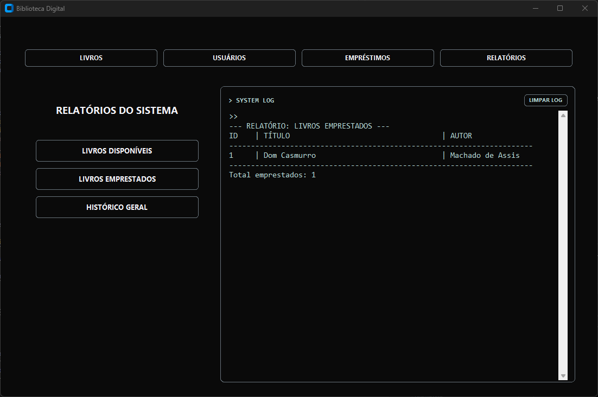
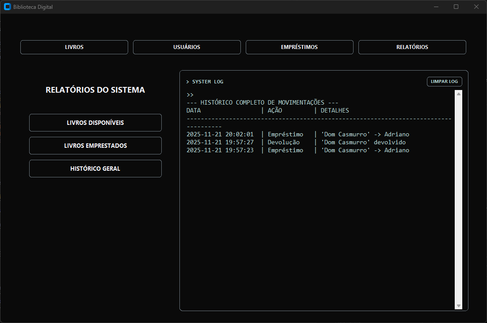

# 📄 Relatório – Biblioteca Digital

## 🔶 Descrição do Problema

O objetivo do projeto foi desenvolver um sistema de **Biblioteca Digital** capaz de gerenciar livros, usuários e empréstimos de forma eficiente, confiável e persistente.
Os principais desafios incluem:

* Garantir **persistência de dados** mesmo após o encerramento do programa.
* Controlar a **disponibilidade dos livros** e evitar empréstimos duplicados.
* Registrar **histórico completo de movimentações** (empréstimos e devoluções).
* Fornecer **relatórios claros** para análise rápida do acervo e movimentações.
* Criar uma **interface gráfica** intuitiva para interação do usuário, com logs de operações.


## 🔶 Estruturas de Dados Utilizadas

Para atender aos objetivos, foram utilizadas estruturas simples e eficientes:

| Estrutura                               | Utilização                                                                                          |
| --------------------------------------- | --------------------------------------------------------------------------------------------------- |
| **Lista de dicionários (`list[dict]`)** | Armazenamento de livros, permitindo iteração e filtragem por atributos.                             |
| **Dicionário (`dict`)**                 | Armazenamento de usuários, usando `id` como chave para acesso rápido.                               |
| **JSON**                                | Persistência de dados para livros, usuários e histórico de empréstimos/devoluções.                  |
| **Fila (`list`)**                       | Fila de empréstimos temporária, garantindo que cada operação seja registrada antes da persistência. |

Exemplo de um registro de empréstimo:

```json
{
  "tipo": "Empréstimo",
  "usuario_id": 1,
  "usuario_nome": "João Silva",
  "livro_id": 10,
  "livro_titulo": "Python Avançado",
  "data": "2025-11-21 14:30:15"
}
```


## 🔶 Justificativa Técnica

* **Python** foi escolhido por sua simplicidade e riqueza de bibliotecas.
* **JSON** foi utilizado para persistência de dados por ser leve e fácil de ler, sem necessidade de configuração de banco de dados.
* **CustomTkinter** permitiu criar uma **interface moderna** e responsiva.
* A modularização do código (`componentes/` e `views/`) garante **manutenção fácil**, isolamento de responsabilidades e expansão futura.
* Funções de log e captura de saída (`call_and_capture`) permitem **rastreabilidade das operações** diretamente na interface.

Decisões técnicas importantes:

* **Separação entre lógica e interface**: Toda regra de negócio fica em `componentes/`, enquanto a interface está em `views/`.
* **Persistência imediata**: Toda alteração (cadastro, remoção, empréstimo, devolução) atualiza o arquivo JSON, evitando perda de dados.
* **Tratamento de erros**: Funções verificam validade de IDs, existência de registros e estado de disponibilidade.


## 🔶 Demonstração dos Resultados

### 4.1 Cadastro e Listagem de Livros

* Adição de livros com ID, título e autor.
* Listagem apresenta quantidade total e status (disponível/emprestado).




### 4.2 Cadastro e Listagem de Usuários

* Usuários cadastrados com ID, nome e email.
* Listagem rápida para ver todos os usuários ativos.


### 4.3 Empréstimos e Devoluções

* Registro de empréstimos apenas se livro disponível e usuário existente.
* Devoluções atualizam status do livro e histórico.





### 4.4 Relatórios

* Livros disponíveis, livros emprestados e histórico completo são exibidos em **tabelas formatadas no console**.






## 🔶 Conclusão sobre Desempenho e Aprendizados

* O sistema cumpre os objetivos iniciais, com **cadastros, consultas, empréstimos, devoluções e relatórios** funcionando de forma integrada.
* A **persistência em JSON** mostrou-se eficiente para o escopo do projeto, permitindo operações rápidas e confiáveis.
* A modularização facilitou **manutenção e expansão futura**, bem como a colaboração entre membros do grupo.
* A interface gráfica proporcionou **melhor experiência do usuário**, mostrando logs em tempo real e resultados imediatos.
* Aprendizados principais:

  * Separação entre **lógica de negócio e interface**.
  * Boas práticas de **persistência de dados e manipulação de arquivos JSON**.
  * Gerenciamento de **IDs únicos e consistência de dados**.
  * Criação de **relatórios legíveis** e rastreabilidade de operações.


#

